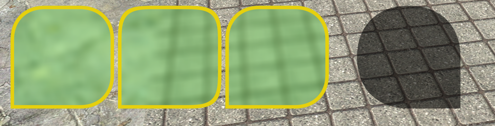
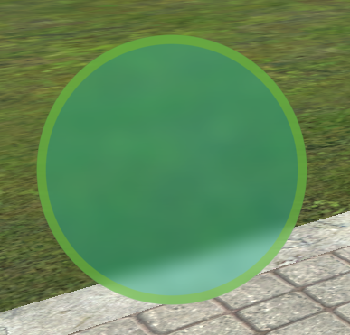
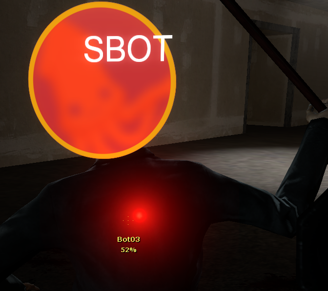
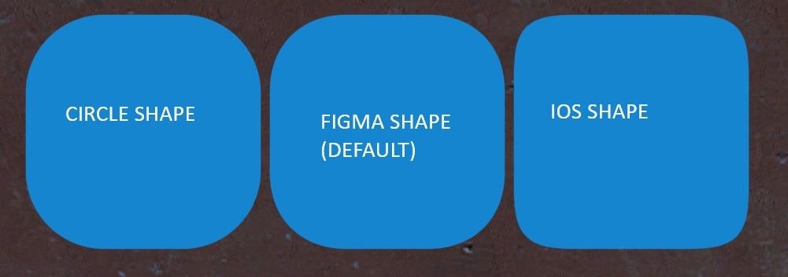

# 🎨 RNDX

**Draw rounded shapes with ease.**
RNDX is a lightweight and efficient library designed to make drawing rounded shapes simple, fast, and visually stunning.

Using Shader Model 3.0, RNDX provides near-perfect anti-aliasing with no performance hit, allowing you to create beautiful interfaces and visuals with ease.





---

## ✨ Why RNDX?

- **Blazing Fast Performance**: Optimized for speed, RNDX is incredibly lightweight and efficient. _(It will get even faster once we [get `mat:SetFloat4()`](https://github.com/Facepunch/garrysmod-requests/issues/2606)!)_
- **Perfect Anti-Aliasing**: Enjoy smooth, pixel-perfect corners with no performance hit.
- **Simple & Intuitive**: No complex objects or states—just call a function and draw!
- **Seamless Integration**: Works flawlessly inside `3D2D` and `Panel:Paint*` functions without any hacks.

---

## 🛠️ Get Started

1. Download `rndx.lua` from [GitHub releases](https://github.com/Srlion/RNDX/releases/latest).
2. Add `rndx.lua` to your project.
3. Run `include` on `rndx.lua`. (It's already calls `AddCSLuaFile` for you!)
4. Voilà! You're ready to draw rounded shapes with ease. 🎉

---

## 📐 Usage

```lua
local RNDX = include("rndx.lua")
hook.Add("HUDPaint", "RNDX Example", function()
    local flags = RNDX.NO_TL + RNDX.NO_TR + RNDX.SHAPE_IOS
    RNDX.Draw(10, 100, 100, 200, 200, nil, flags + RNDX.BLUR)
    RNDX.Draw(10, 100, 100, 200, 200, Color(255, 0, 0, 150), flags)
    RNDX.DrawOutlined(10, 100, 100, 200, 200, Color(0, 255, 0), 10, flags)
end)
```

## 📚 Documentation

### Flags

- **`RNDX.NO_TL`**: Disables top-left corner.
- **`RNDX.NO_TR`**: Disables top-right corner.
- **`RNDX.NO_BL`**: Disables bottom-left corner.
- **`RNDX.NO_BR`**: Disables bottom-right corner.
- **`RNDX.BLUR`**: Use blur for the shape.
- **`RNDX.MANUAL_COLOR`**: Allows setting the color via `surface.SetDrawColor`.

---

- **`RNDX.SHAPE_CIRCLE`**
- **`RNDX.SHAPE_FIGMA`** <-- Default
- **`RNDX.SHAPE_IOS`**



---

### Functions

### `RNDX.Draw(rad, x, y, w, h, col, flags)`

### `RNDX.DrawOutlined(rad, x, y, w, h, col, thickness, flags)`

### `RNDX.DrawTexture(rad, x, y, w, h, col, texture, flags)`

### `RNDX.DrawMaterial(rad, x, y, w, h, col, mat, flags)`

### `RNDX.DrawCircle(x, y, r, col, flags)` <-- Just a wrapper for `RNDX.Draw` with `RNDX.SHAPE_CIRCLE`.

### `RNDX.DrawCircleOutlined(x, y, r, col, thickness, flags)`

### `RNDX.DrawCircleTexture(x, y, r, col, texture, flags)`

### `RNDX.DrawCircleMaterial(x, y, r, col, mat, flags)`

---

## 🚀 Why Choose RNDX Over Alternatives?

| Feature           | RNDX                            | [Circles](https://github.com/SneakySquid/Circles) | [paint](https://github.com/Jaffies/paint) | [melonstuff](https://github.com/melonstuff) |
| ----------------- | ------------------------------- | ------------------------------------------------- | ----------------------------------------- | ------------------------------------------- |
| **Speed**         | ⚡ Extremely Fast               | 🐌 Slow with many circles                         | ⚡ Fast                                   | 🐌 Slow                                     |
| **Anti-Aliasing** | ✅ Perfect, no performance cost | ❌ None                                           | ❌ Poor (Source Engine AA)                | ❌ None                                     |
| **Ease of Use**   | 🎯 Simple & Minimal             | 🎯 Simple                                         | 🧩 Complex & Bloated                      | 🎯 Easy                                     |
| **Documentation** | 📖 Clear & Concise              | 📖 Good                                           | ❌ Overwhelming & Undocumented            | 📖 Good                                     |

---

## Benchmarks

Benchmarking has to be done with FPS meter, not checking how long cpu takes to draw.

#### Rounded Shapes

```lua
local RNDX = include("rndx.lua")
local draw_RoundedBox = draw.RoundedBox
local col = Color(0, 0, 0, 255)
hook.Add("HUDPaint", "my_shader_draw", function()
	for i = 1, 3000 do
		RNDX.Draw(20, 20, 20, 200, 200, col)
		-- draw_RoundedBox(20, 20, 20, 200, 200, col)
	end
end)
```

- `RNDX`: 140 FPS
- `draw.RoundedBox`: 43 FPS

#### Blur

150 Calls
`x y w h` of `10, 10, 700, 700`

- `Current RNDX`: 107 fps
- `Previous RNDX`: 73 fps
- https://pastebin.com/urx4Qvez : 59 fps

## 📜 License

RNDX is open-source and free to use. Feel free to contribute or report issues on GitHub!

Make sure to give credits!

---

## 🌟 Credits

- [ficool2](https://github.com/ficool2) - For [sdk_screenspace_shaders](https://github.com/ficool2/sdk_screenspace_shaders) & finding out that we can use shaders in source engine games!
- [Rubat](https://github.com/robotboy655) - For allowing us to use shaders in Garry's Mod!
- [Svetov/Jaffies/FriendlyStealer](https://github.com/Jaffies) - For lots of help throughout the development of RNDX! Also suggested multiple stuff to improve the performance!
- [Shadertoy Rounded Code](https://www.shadertoy.com/view/fsdyzB)
- [Shadertoy Blur Code](https://www.shadertoy.com/view/Xd33Rf)
- And AI because I don't understand how shaders work!

**RNDX**: Because drawing rounded shapes should be simple, fast, and beautiful. 🎉
