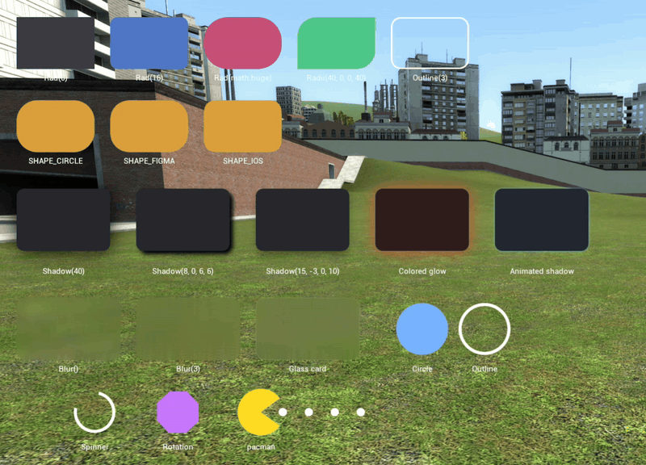

# 🇵🇸 RNDX 🇵🇸

**Draw rounded shapes with ease.**

Shader-powered drawing library for Garry's Mod. Rounded boxes, circles, outlines, blur and CSS-style shadows — with near-perfect anti-aliasing and no performance hit.


## Install

1. Download `rndx.lua` from [releases](https://github.com/Srlion/RNDX/releases/latest).
2. Put it in your project.
3. `local RNDX = include("rndx.lua")` — `AddCSLuaFile` is called for you.

## Usage

```lua
local RNDX = include("rndx.lua")

hook.Add("HUDPaint", "RNDX Example", function()
    RNDX.Rect(100, 100, 200, 100)
        :Rad(16)
        :Color(30, 30, 30)
        :Draw()

    -- shadow: blur, spread, offset x, offset y (like css box-shadow)
    RNDX.Rect(350, 100, 200, 100)
        :Rad(16)
        :Color(40, 40, 45)
        :Shadow(24, 0, 0, 8)
        :Draw()

    -- frosted glass
    RNDX.Rect(600, 100, 200, 100)
        :Rad(16)
        :Blur(2)
        :Draw()

    RNDX.Circle(200, 400, 80)
        :Color(255, 100, 100)
        :Outline(4)
        :Draw()
end)
```

## API

`RNDX.Rect(x, y, w, h)` and `RNDX.Circle(x, y, radius)` return a builder. Chain methods, end with `:Draw()`.

> [!NOTE]
> Chaining is free — no objects are created, the builder writes to shared state. So build and `:Draw()` in one go, don't store builders for later.

| Method | Description |
| --- | --- |
| `:Rad(r)` | Corner radius (Rect only) |
| `:Radii(tl = 0, tr = 0, bl = 0, br = 0)` | Per-corner radii (Rect only) |
| `:Color(col)` / `:Color(r, g, b, a = 255)` | Fill color |
| `:ManualColor()` | Skip color setting, use your own `surface.SetDrawColor` |
| `:Outline(thickness = 1)` | Outline instead of fill |
| `:Texture(tex)` | Textured fill |
| `:Material(mat)` | Textured fill from a material |
| `:Blur(intensity = 1)` | Backdrop blur |
| `:Shadow(blur = 20, spread = 0, ox = 0, oy = 0)` | CSS-style shadow, defaults to black |
| `:Shape(shape)` | `RNDX.SHAPE_CIRCLE` / `RNDX.SHAPE_FIGMA` (default) / `RNDX.SHAPE_IOS` |
| `:Rotation(deg = 0)` | Rotate the shape |
| `:Angles(start_deg = 0, end_deg = 360)` | Draw an arc/pie segment |
| `:Clip(panel)` | Clip to a panel |
| `:Draw()` | Draw it |


Defaults:

```lua
RNDX.SetDefaultShape(RNDX.SHAPE_IOS)
RNDX.SetDefaultBlurIntensity(3)
RNDX.SetLegacyGamma(true) -- match gmod's default (broken) gamma, so colors look the same as draw.RoundedBox & other addons
```

## Showcase



```lua
RNDX.SetDefaultShape(SHAPE_IOS)

local GRADIENT_MAT = Material("gui/gradient")

local function label(text, x, w, y)
    draw.SimpleText(text, "DermaDefault", x + w / 2, y, color_white,
        TEXT_ALIGN_CENTER, TEXT_ALIGN_TOP)
end

hook.Add("HUDPaint", "RNDX_Showcase", function()
    local t = CurTime()

    local sw, sh = ScrW(), ScrH()

    -- grid: 5 columns, 6 rows, everything positioned off these
    local col_w = sw / 5
    local row_h = sh / 7

    local box_w = col_w * 0.6
    local box_h = row_h * 0.55
    local pad_x = (col_w - box_w) * 0.5

    local function cell(col, row)
        return (col - 1) * col_w + pad_x, (row - 1) * row_h + row_h * 0.12
    end

    local function clabel(text, col, row)
        local x = (col - 1) * col_w
        label(text, x, col_w, (row - 1) * row_h + row_h * 0.12 + box_h + 6)
    end

    local rad = sh * 0.015

    -- row 1: radii & outline
    local x, y = cell(1, 1)
    RNDX.Rect(x, y, box_w, box_h):Rad(0):Color(60, 60, 70):Draw()
    clabel("Rad(0)", 1, 1)

    x, y = cell(2, 1)
    RNDX.Rect(x, y, box_w, box_h):Rad(rad):Color(80, 120, 200):Draw()
    clabel("Rad(16)", 2, 1)

    x, y = cell(3, 1)
    RNDX.Rect(x, y, box_w, box_h):Rad(math.huge):Color(200, 80, 120):Draw()
    clabel("Rad(math.huge)", 3, 1)

    x, y = cell(4, 1)
    RNDX.Rect(x, y, box_w, box_h):Radii(rad * 2.5, 0, 0, rad * 2.5):Color(80, 200, 140):Draw()
    clabel("Radii(tl, 0, 0, br)", 4, 1)

    x, y = cell(5, 1)
    RNDX.Rect(x, y, box_w, box_h):Rad(rad):Color(255, 255, 255):Outline(3):Draw()
    clabel("Outline(3)", 5, 1)

    -- row 2: corner shapes & rotation
    x, y = cell(1, 2)
    RNDX.Rect(x, y, box_w, box_h):Rad(rad * 2.5):Shape(RNDX.SHAPE_CIRCLE):Color(220, 160, 60):Draw()
    clabel("SHAPE_CIRCLE", 1, 2)

    x, y = cell(2, 2)
    RNDX.Rect(x, y, box_w, box_h):Rad(rad * 2.5):Shape(RNDX.SHAPE_FIGMA):Color(220, 160, 60):Draw()
    clabel("SHAPE_FIGMA", 2, 2)

    x, y = cell(3, 2)
    RNDX.Rect(x, y, box_w, box_h):Rad(rad * 2.5):Shape(RNDX.SHAPE_IOS):Color(220, 160, 60):Draw()
    clabel("SHAPE_IOS", 3, 2)

    x, y = cell(4, 2)
    local sq = math.min(box_w, box_h)
    RNDX.Rect(x + (box_w - sq) * 0.5, y, sq, sq)
        :Rad(sq * 0.3)
        :Shape(RNDX.SHAPE_IOS)
        :Color(200, 120, 255)
        :Rotation(t * 60 % 360)
        :Draw()
    clabel("Rotation", 4, 2)

    -- pacman
    x, y = cell(5, 2)
    local cr = sq * 0.5
    local cx, cy = x + cr, y + box_h * 0.5
    local chomp = math.abs(math.sin(t * 6)) * 40 + 5
    RNDX.Circle(cx, cy, cr):Color(255, 220, 40):Angles(chomp, 360 - chomp):Draw()

    local px = (t * cr * 2) % (cr * 5)
    for i = 0, 3 do
        local dot_x = cx + cr * 1.5 + i * cr * 1.2 - px
        if dot_x > cx + cr then
            RNDX.Circle(dot_x, cy, cr * 0.18):Color(255, 255, 255):Draw()
        end
    end
    clabel("pacman", 5, 2)

    -- row 3: shadows
    x, y = cell(1, 3)
    RNDX.Rect(x, y, box_w, box_h):Rad(rad):Shadow(40):Draw()
    RNDX.Rect(x, y, box_w, box_h):Rad(rad):Color(40, 40, 48):Draw()
    clabel("Shadow(40)", 1, 3)

    x, y = cell(2, 3)
    RNDX.Rect(x, y, box_w, box_h):Rad(rad):Shadow(8, 0, 6, 6):Draw()
    RNDX.Rect(x, y, box_w, box_h):Rad(rad):Color(40, 40, 48):Draw()
    clabel("Shadow(8, 0, 6, 6)", 2, 3)

    x, y = cell(3, 3)
    RNDX.Rect(x, y, box_w, box_h):Rad(rad):Color(255, 60, 60, 180):Shadow(30):Draw()
    RNDX.Rect(x, y, box_w, box_h):Rad(rad):Color(50, 30, 30):Draw()
    clabel("Colored glow", 3, 3)

    x, y = cell(4, 3)
    local pulse = 15 + math.sin(t * 2) * 10
    RNDX.Rect(x, y, box_w, box_h):Rad(rad):Color(100, 200, 255, 200):Shadow(pulse):Draw()
    RNDX.Rect(x, y, box_w, box_h):Rad(rad):Color(30, 40, 50):Draw()
    clabel("Animated shadow", 4, 3)

    x, y = cell(5, 3)
    RNDX.Rect(x, y, box_w, box_h):Rad(rad):Color(0, 0, 0, 220):Shadow(25, -20, 0, 15):Draw()
    RNDX.Rect(x, y, box_w, box_h):Rad(rad):Color(60, 60, 70):Draw()
    clabel("Negative spread", 5, 3)

    -- row 4: shadow clip & spread
    x, y = cell(1, 4)
    RNDX.Rect(x, y, box_w, box_h):Rad(rad):Color(255, 180, 60):Shadow(20):Draw()
    RNDX.Rect(x, y, box_w, box_h):Rad(rad):Color(40, 40, 48, 128):Draw()
    clabel("Clipped glow, 50% fill", 1, 4)

    -- orbit loader
    x, y = cell(2, 4)
    cx, cy = x + box_w * 0.5, y + box_h * 0.5
    local or1 = math.min(box_w, box_h) * 0.48
    local or2 = or1 * 0.72
    local or3 = or1 * 0.44

    local a1 = t * 120 % 360
    local a2 = -t * 200 % 360
    local a3 = t * 320 % 360

    RNDX.Circle(cx, cy, or1):Color(120, 180, 255):Outline(6):Angles(a1, a1 + 120):Shadow(10):Draw()
    RNDX.Circle(cx, cy, or1):Color(120, 180, 255, 180):Outline(6):Angles(a1, a1 + 120):Draw()

    RNDX.Circle(cx, cy, or2):Color(200, 120, 255):Outline(6):Angles(a2, a2 + 160):Shadow(10):Draw()
    RNDX.Circle(cx, cy, or2):Color(200, 120, 255, 180):Outline(6):Angles(a2, a2 + 160):Draw()

    RNDX.Circle(cx, cy, or3):Color(255, 160, 80):Outline(6):Angles(a3, a3 + 90):Shadow(10):Draw()
    RNDX.Circle(cx, cy, or3):Color(255, 160, 80, 180):Outline(6):Angles(a3, a3 + 90):Draw()

    clabel("Orbit loader", 2, 4)

    x, y = cell(3, 4)
    RNDX.Rect(x, y, box_w, box_h):Rad(0):Color(120, 80, 200):Shadow(0.1, 12):Draw()
    RNDX.Rect(x, y, box_w, box_h):Rad(0):Color(40, 40, 48):Draw()
    clabel("Sharp spread, Rad(0)", 3, 4)

    x, y = cell(4, 4)
    RNDX.Rect(x, y, box_w, box_h):Radii(rad * 2, 0, 0, rad * 2):Color(80, 200, 140):Shadow(10, 10):Draw()
    RNDX.Rect(x, y, box_w, box_h):Radii(rad * 2, 0, 0, rad * 2):Color(40, 40, 48):Draw()
    clabel("Mixed radii spread", 4, 4)

    x, y = cell(5, 4)
    RNDX.Rect(x, y, box_w, box_h):Rad(rad):Color(255, 255, 255):Shadow(15, 2):Draw()
    RNDX.Rect(x, y, box_w, box_h):Rad(rad):Material(GRADIENT_MAT):Color(255, 255, 255):Draw()
    clabel("Texture + shadow", 5, 4)

    -- row 5: arc shadows (circles)
    local ar = math.min(box_w, box_h) * 0.5

    x, y = cell(1, 5)
    cx, cy = x + box_w * 0.5, y + box_h * 0.5
    RNDX.Circle(cx, cy, ar):Color(255, 120, 60):Angles(0, 90):Shadow(15):Draw()
    RNDX.Circle(cx, cy, ar):Color(255, 120, 60):Angles(0, 90):Draw()
    clabel("Arc shadow 90", 1, 5)

    x, y = cell(2, 5)
    cx, cy = x + box_w * 0.5, y + box_h * 0.5
    RNDX.Circle(cx, cy, ar):Color(120, 180, 255):Angles(30, 330):Shadow(15):Draw()
    RNDX.Circle(cx, cy, ar):Color(120, 180, 255):Angles(30, 330):Draw()
    clabel("Arc shadow 300", 2, 5)

    x, y = cell(3, 5)
    cx, cy = x + box_w * 0.5, y + box_h * 0.5
    local spin = t * 360 % 360
    RNDX.Circle(cx, cy, ar):Color(100, 220, 255):Outline(8):Angles(0, 270)
        :Rotation(spin):Shadow(12):Draw()
    RNDX.Circle(cx, cy, ar):Color(100, 220, 255):Outline(8):Angles(0, 270)
        :Rotation(spin):Draw()
    clabel("Glow spinner", 3, 5)

    x, y = cell(4, 5)
    cx, cy = x + box_w * 0.5, y + box_h * 0.5
    local prog = (math.sin(t) * 0.5 + 0.5) * 360
    RNDX.Circle(cx, cy, ar):Color(80, 255, 160):Outline(10):Angles(-90, -90 + prog):Shadow(10):Draw()
    RNDX.Circle(cx, cy, ar):Color(80, 255, 160):Outline(10):Angles(-90, -90 + prog):Draw()
    clabel("Progress glow", 4, 5)

    x, y = cell(5, 5)
    cx, cy = x + box_w * 0.5, y + box_h * 0.5
    RNDX.Circle(cx, cy, ar):Color(255, 80, 80):Angles(45, 75):Shadow(30):Draw()
    RNDX.Circle(cx, cy, ar):Color(255, 80, 80):Angles(45, 75):Draw()
    clabel("Narrow wedge stress", 5, 5)

    -- row 6: everything at once
    x, y = cell(1, 6)
    local wob = math.sin(t * 1.5) * 25
    local sq2 = math.min(box_w, box_h)
    local wx = x + (box_w - sq2) * 0.5
    RNDX.Rect(wx, y, sq2, sq2):Rad(sq2 * 0.2):Color(200, 120, 255):Angles(0, 270)
        :Rotation(wob):Shadow(15, 0, 8, 8):Draw()
    RNDX.Rect(wx, y, sq2, sq2):Rad(sq2 * 0.2):Color(200, 120, 255, 140):Angles(0, 270)
        :Rotation(wob):Draw()
    clabel("Rotated arc, offset, 55% fill", 1, 6)

    -- sweep 0..360: fades to nothing and back, no pop at either end
    x, y = cell(2, 6)
    cx, cy = x + box_w * 0.5, y + box_h * 0.5
    local ar2 = math.min(box_w, box_h) * 0.45
    local sweep = (math.sin(t * 0.8) * 0.5 + 0.5) * 360

    RNDX.Circle(cx, cy, ar2):Color(255, 120, 180):Angles(-90, -90 + sweep):Shadow(12):Draw()
    RNDX.Circle(cx, cy, ar2):Color(255, 120, 180, 200):Angles(-90, -90 + sweep):Draw()

    clabel("Sweep 0 to 360", 2, 6)

    x, y = cell(3, 6)
    cx, cy = x + box_w * 0.5, y + box_h * 0.5
    RNDX.Circle(cx, cy, ar):Angles(0, 240):Blur(2):Shadow(20):Draw()
    RNDX.Circle(cx, cy, ar):Color(255, 255, 255, 40):Outline(1):Angles(0, 240):Draw()
    clabel("Blurred arc shadow", 3, 6)

    x, y = cell(4, 6)
    RNDX.Rect(x, y, box_w, box_h):Rad(rad):Blur():Draw()
    clabel("Blur()", 4, 6)

    x, y = cell(5, 6)
    RNDX.Rect(x, y, box_w, box_h):Rad(rad):Blur(2):Draw()
    RNDX.Rect(x, y, box_w, box_h):Rad(rad):Color(255, 255, 255, 30):Outline(1):Draw()
    clabel("Glass card", 5, 6)

    -- row 7: circles & spinner
    x, y = cell(1, 7)
    cx, cy = x + box_w * 0.5, y + box_h * 0.5
    RNDX.Circle(cx, cy, ar):Color(120, 180, 255):Draw()
    clabel("Circle", 1, 7)

    x, y = cell(2, 7)
    cx, cy = x + box_w * 0.5, y + box_h * 0.5
    RNDX.Circle(cx, cy, ar):Color(255, 255, 255):Outline(6):Draw()
    clabel("Circle outline", 2, 7)

    x, y = cell(3, 7)
    cx, cy = x + box_w * 0.5, y + box_h * 0.5
    RNDX.Circle(cx, cy, ar)
        :Color(255, 255, 255)
        :Outline(6)
        :Angles(0, 270)
        :Rotation(t * 360 % 360)
        :Draw()
    clabel("Spinner", 3, 7)

    x, y = cell(4, 7)
    cx, cy = x + box_w * 0.5, y + box_h * 0.5
    RNDX.Circle(cx, cy, ar):Color(255, 120, 200):Texture(GRADIENT_MAT:GetTexture("$basetexture")):Draw()
    clabel("Circle texture", 4, 7)

    x, y = cell(5, 7)
    cx, cy = x + box_w * 0.5, y + box_h * 0.5
    RNDX.Circle(cx, cy, ar):Color(60, 220, 180):Shadow(15):Draw()
    RNDX.Circle(cx, cy, ar):Color(60, 220, 180, 150):Draw()
    clabel("Circle glow, translucent", 5, 7)
end)
```

## Benchmarks (OLD)

Benchmark with an FPS meter, not CPU frame time.

3000 rounded boxes per frame:

- RNDX: 140 FPS
- draw.RoundedBox: 43 FPS

150 blur panels (700x700):

- Current RNDX: 107 FPS
- Previous RNDX: 73 FPS
- <https://pastebin.com/urx4Qvez>: 59 FPS

## Credits

- [ficool2](https://github.com/ficool2) - [sdk_screenspace_shaders](https://github.com/ficool2/sdk_screenspace_shaders) & finding out we can use shaders in source games
- [Rubat](https://github.com/robotboy655) - for allowing shaders in Garry's Mod
- [Svetov/Jaffies](https://github.com/Jaffies) - lots of help & performance ideas
- [Shadertoy rounded box](https://www.shadertoy.com/view/fsdyzB), [Shadertoy blur](https://www.shadertoy.com/view/Xd33Rf), [Evan Wallace's shadow math](https://madebyevan.com/shaders/fast-rounded-rectangle-shadows/)
- And AI because I don't understand how shaders work!

## License

MIT. Make sure to give credits!
