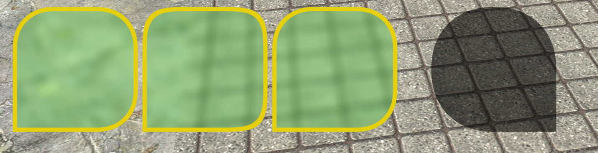
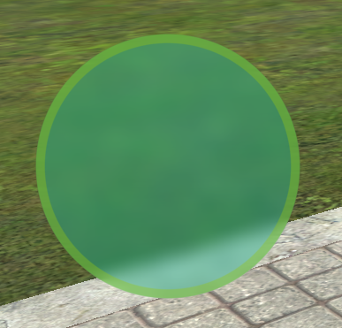
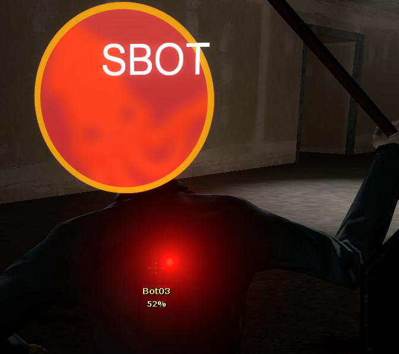
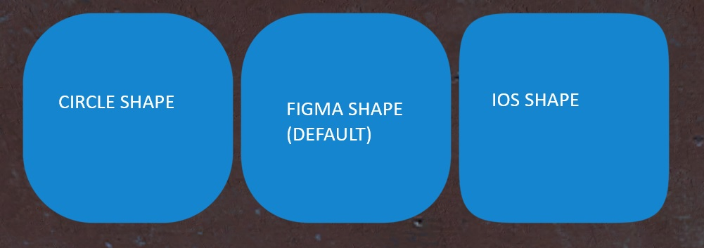

# 🇵🇸 RNDX 🇵🇸

**Draw rounded shapes with ease.**

Shader-powered drawing library for Garry's Mod. Rounded boxes, circles, outlines, blur and CSS-style shadows — with near-perfect anti-aliasing and no performance hit.





## Install

1. Download `rndx.lua` from [releases](https://github.com/Srlion/RNDX/releases/latest).
2. Put it in your project.
3. `local RNDX = include("rndx.lua")` — `AddCSLuaFile` is called for you.

## Usage

```lua
local RNDX = include("rndx.lua")

hook.Add("HUDPaint", "RNDX Example", function()
    RNDX.Rect(100, 100, 200, 100)
        :Rad(16)
        :Color(30, 30, 30)
        :Draw()

    -- shadow: blur, spread, offset x, offset y (like css box-shadow)
    RNDX.Rect(350, 100, 200, 100)
        :Rad(16)
        :Color(40, 40, 45)
        :Shadow(24, 0, 0, 8)
        :Draw()

    -- frosted glass
    RNDX.Rect(600, 100, 200, 100)
        :Rad(16)
        :Blur(2)
        :Draw()

    RNDX.Circle(200, 400, 80)
        :Color(255, 100, 100)
        :Outline(4)
        :Draw()
end)
```

## API

`RNDX.Rect(x, y, w, h)` and `RNDX.Circle(x, y, radius)` return a builder. Chain methods, end with `:Draw()`.

> [!NOTE]
> Chaining is free — no objects are created, the builder writes to shared state. So build and `:Draw()` in one go, don't store builders for later.

| Method | Description |
| --- | --- |
| `:Rad(r)` | Corner radius (Rect only) |
| `:Radii(tl = 0, tr = 0, bl = 0, br = 0)` | Per-corner radii (Rect only) |
| `:Color(col)` / `:Color(r, g, b, a = 255)` | Fill color |
| `:ManualColor()` | Skip color setting, use your own `surface.SetDrawColor` |
| `:Outline(thickness = 1)` | Outline instead of fill |
| `:Texture(tex)` | Textured fill |
| `:Material(mat)` | Textured fill from a material |
| `:Blur(intensity = 1)` | Backdrop blur |
| `:Shadow(blur = 20, spread = 0, ox = 0, oy = 0)` | CSS-style shadow, defaults to black |
| `:Shape(shape)` | `RNDX.SHAPE_CIRCLE` / `RNDX.SHAPE_FIGMA` (default) / `RNDX.SHAPE_IOS` |
| `:Rotation(deg = 0)` | Rotate the shape |
| `:Angles(start_deg = 0, end_deg = 360)` | Draw an arc/pie segment |
| `:Clip(panel)` | Clip to a panel |
| `:Draw()` | Draw it |



Defaults:

```lua
RNDX.SetDefaultShape(RNDX.SHAPE_IOS)
RNDX.SetDefaultBlurIntensity(3)
RNDX.SetLegacyGamma(true) -- match gmod's default (broken) gamma, so colors look the same as draw.RoundedBox & other addons
```

## Examples

```lua
draw.RoundedBox(8, x, y, w, h, col)          -- old
RNDX.Rect(x, y, w, h):Rad(8):Color(col):Draw() -- rndx
```

Pill / fully rounded ends:

```lua
RNDX.Rect(x, y, 120, 36):Rad(math.huge):Color(80, 160, 255):Draw()
```

Rounded top corners only:

```lua
RNDX.Rect(x, y, w, h):Radii(8, 8, 0, 0):Color(40, 40, 45):Draw()
```

Card with a soft shadow:

```lua
RNDX.Rect(x, y, 300, 180):Rad(12):Shadow(30, 0, 0, 10):Draw() -- shadow
RNDX.Rect(x, y, 300, 180):Rad(12):Color(35, 35, 40):Draw()    -- card
```

Loading spinner:

```lua
RNDX.Circle(x, y, 24)
    :Color(255, 255, 255)
    :Outline(4)
    :Angles(0, 270)
    :Rotation(CurTime() * 360 % 360)
    :Draw()
```

Progress bar:

```lua
RNDX.Rect(x, y, 200, 8):Rad(4):Color(50, 50, 50):Draw()
RNDX.Rect(x, y, 200 * progress, 8):Rad(4):Color(80, 160, 255):Draw()
```

Inside a panel:

```lua
function PANEL:Paint(w, h)
    RNDX.Rect(0, 0, w, h):Rad(8):Color(30, 30, 30, 240):Blur():Draw()
end
```

## Benchmarks (OLD)

Benchmark with an FPS meter, not CPU frame time.

3000 rounded boxes per frame:

- RNDX: 140 FPS
- draw.RoundedBox: 43 FPS

150 blur panels (700x700):

- Current RNDX: 107 FPS
- Previous RNDX: 73 FPS
- <https://pastebin.com/urx4Qvez>: 59 FPS

## Credits

- [ficool2](https://github.com/ficool2) - [sdk_screenspace_shaders](https://github.com/ficool2/sdk_screenspace_shaders) & finding out we can use shaders in source games
- [Rubat](https://github.com/robotboy655) - for allowing shaders in Garry's Mod
- [Svetov/Jaffies](https://github.com/Jaffies) - lots of help & performance ideas
- [Shadertoy rounded box](https://www.shadertoy.com/view/fsdyzB), [Shadertoy blur](https://www.shadertoy.com/view/Xd33Rf), [Evan Wallace's shadow math](https://madebyevan.com/shaders/fast-rounded-rectangle-shadows/)
- And AI because I don't understand how shaders work!

## License

MIT. Make sure to give credits!
